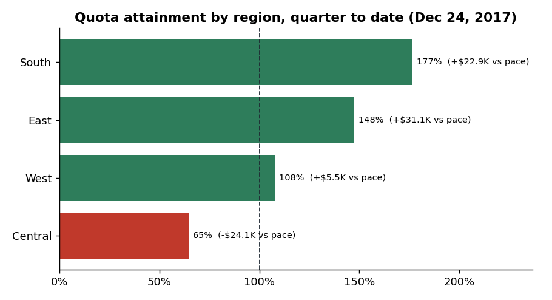
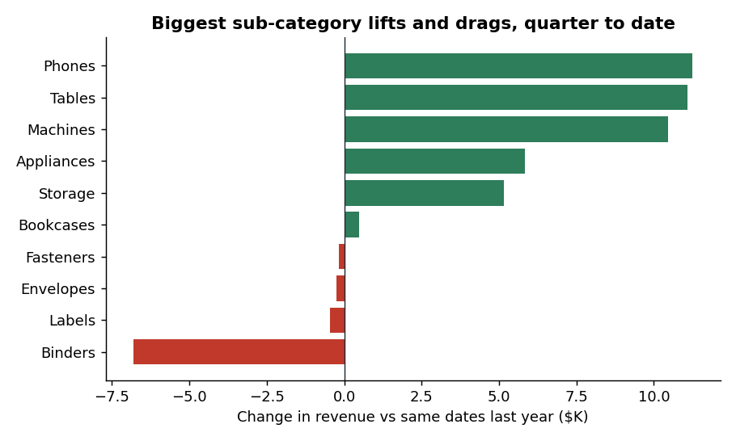
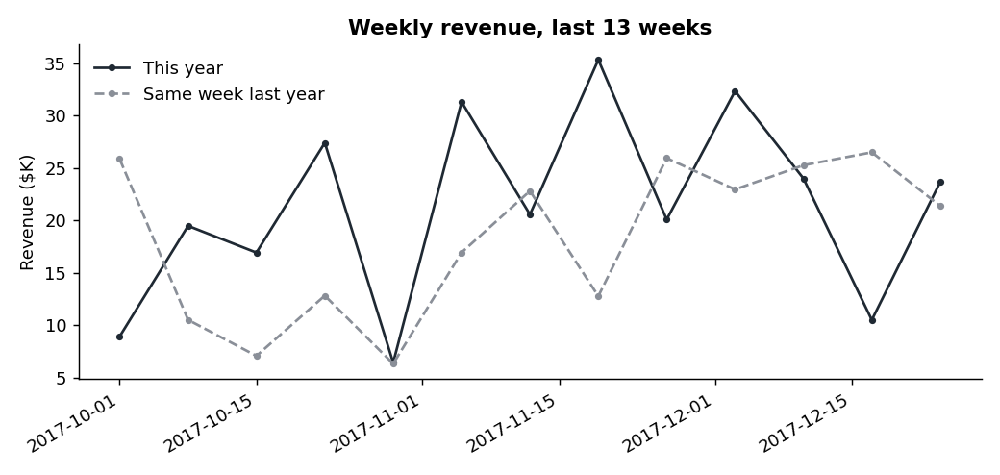
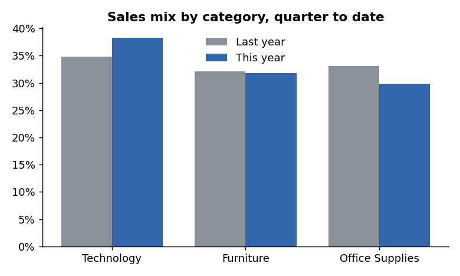
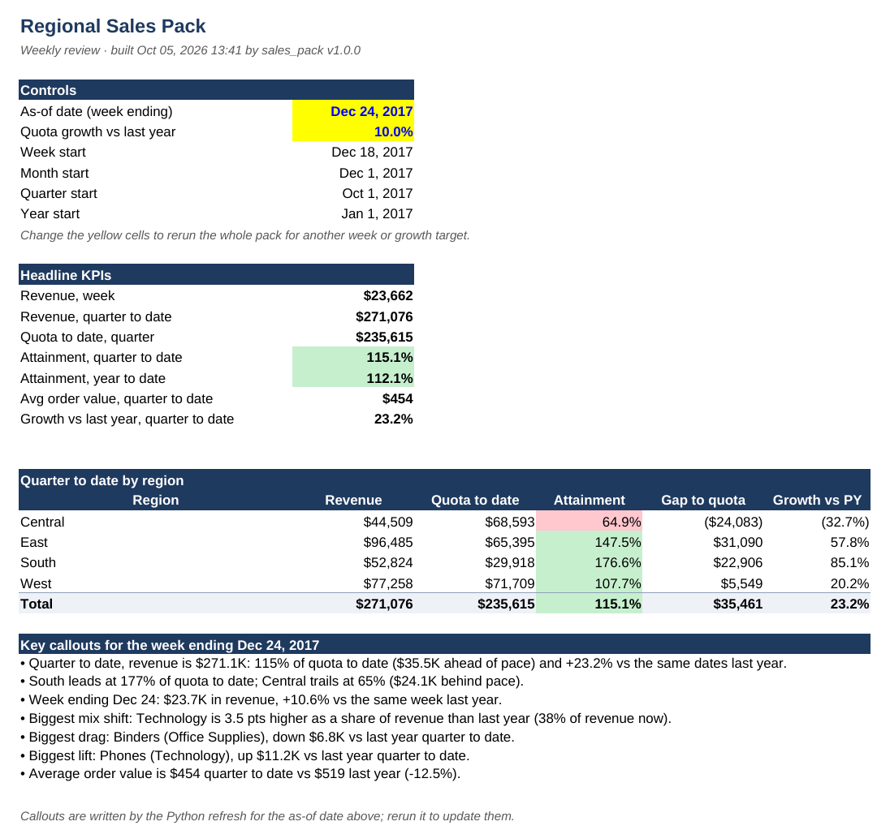

# Sales Performance Intelligence

An automated weekly sales pack for regional sales reviews. Python cleans a raw sales extract and builds:

- **An Excel sales pack** tracking revenue, quota attainment, average order value (AOV) and sales mix by region for the week, month, quarter and year to date. Every number is a live Excel formula, so changing the as-of date or the quota growth target recalculates the whole pack.
- **A Tableau feed** (two clean CSVs) for an interactive dashboard on Tableau Public.
- **Written callouts**, such as which region is behind pace and which sub-categories drive the change vs last year.

The refresh runs with one command and can be scheduled to run every week.

```
raw sales extract (CSV/Excel)
        │
        ▼
python -m sales_pack ──► output/Sales_Pack_<week>.xlsx   (Summary, Regional, Weekly Trend, Sales Mix, Quotas, Data, Definitions)
                     ├─► output/Sales_Pack_latest.xlsx    (copy for stakeholders)
                     └─► output/tableau/*.csv             (feed for the Tableau dashboard)
```

[`docs/Sales_Pack_sample.xlsx`](docs/Sales_Pack_sample.xlsx) shows what the pack looks like, built from generated sample data.

## Results

Run on the real **Superstore** dataset (9,994 order lines, 5,009 orders, Jan 2014 – Dec 2017) for the week ending **Dec 24, 2017**. Quotas are last year's same month + 10%. All 8 unit tests pass.

| Quarter to date (Oct 1 – Dec 24, 2017) | Value |
|---|---|
| Revenue | $271.1K |
| Quota to date | $235.6K |
| Attainment | **115%** ($35.5K ahead of pace) |
| Growth vs same dates last year | +23.2% |
| Average order value | $454 (vs $519 last year, -12.5%) |

**Key findings**

- **South** leads at **177%** of quota to date; **Central** trails at **65%**, $24.1K behind pace and **down 32.7%** vs last year, while every other region grew.
- **Phones** (+$11.2K), **Tables** and **Machines** drove the growth; **Binders** is the biggest drag (-$6.8K vs last year).
- **Technology** rose 3.5 points as a share of revenue, to 38%.
- Average order value fell **12.5%**: more orders, but smaller ones.

**Recommendation:** focus the Central region review on why revenue fell a third year over year (accounts lost, Binders and Office Supplies demand), and check whether discounting is behind the drop in order value.

| | |
|---|---|
|  |  |
|  |  |



Regenerate the charts with `python scripts/make_charts.py --input data/raw/superstore.csv`.

---

## Project structure

```
sales-performance-intelligence/
├── sales_pack/
│   ├── __main__.py        # command line: python -m sales_pack ...
│   ├── load.py            # read CSV/Excel, standardise columns, clean types
│   ├── periods.py         # week / month / quarter / year-to-date windows
│   ├── quotas.py          # monthly quotas (derived or from an override file)
│   ├── metrics.py         # pandas versions of every metric (callouts + tests)
│   ├── insights.py        # plain-English callouts
│   ├── excel_pack.py      # formula-driven Excel workbook with charts
│   ├── tableau_feed.py    # CSVs for Tableau
│   └── config.py          # column aliases and settings
├── scripts/
│   ├── make_sample_data.py   # generates Superstore-style test data
│   ├── make_charts.py        # README charts in docs/
│   ├── run_weekly.bat        # weekly refresh (Windows)
│   └── run_weekly.sh         # weekly refresh (macOS/Linux)
├── docs/                     # charts, pack screenshot and Sales_Pack_sample.xlsx
├── tests/test_metrics.py
├── data/raw/                 # put your data file here
├── data/reference/quotas_override_example.csv
└── requirements.txt
```

---

## Step 1. Install the tools

| Tool | Why | Where |
|---|---|---|
| Python 3.10 or newer | runs the pipeline | python.org/downloads (Windows: tick **Add python.exe to PATH** during install) |
| Microsoft Excel (or Google Sheets / LibreOffice) | opens the pack | — |
| Tableau Public (free) | dashboard | public.tableau.com |
| Git and a GitHub account | publishing the project | git-scm.com, github.com |
| VS Code (optional) | editing and running code | code.visualstudio.com |

Check Python from a terminal:

```
python --version
```

On Windows, if `python` isn't recognised, try `py --version` and use `py` instead of `python` below.

## Step 2. Set up the project

Unzip the project, open a terminal **inside the project folder**, then create a virtual environment and install the libraries.

**Windows (Command Prompt):**

```
cd path\to\sales-performance-intelligence
python -m venv .venv
.venv\Scripts\activate
pip install -r requirements.txt
```

**macOS / Linux:**

```
cd path/to/sales-performance-intelligence
python3 -m venv .venv
source .venv/bin/activate
pip install -r requirements.txt
```

Your prompt now starts with `(.venv)`. Activate the environment again each time you open a new terminal.

> In Windows PowerShell, if activation is blocked, run `Set-ExecutionPolicy -Scope CurrentUser RemoteSigned` once, or use Command Prompt instead.

## Step 3. Get the data

**Option A: real data (use this for your portfolio).**
Download the **Superstore** dataset from Kaggle (search "Superstore Dataset"; the file is `Sample - Superstore.csv`, about 10,000 order lines). Save it as:

```
data/raw/superstore.csv
```

**Option B: quick test with generated data.**

```
python scripts/make_sample_data.py
```

This writes `data/raw/sample_superstore.csv` (about 10,000 order lines over four years). Use it to check your setup; your resume findings should come from the real data.

Any sales export works if it has these columns (common alternative names are recognised automatically):
**Order ID, Order Date, Region, Category, Sub-Category, Sales**. Optional: State, Segment, Quantity, Profit.

## Step 4. Run the refresh

```
python -m sales_pack --input data/raw/superstore.csv
```

You'll see a summary and the callouts in the terminal, and these files appear:

| File | What it is |
|---|---|
| `output/Sales_Pack_<YYYY-MM-DD>.xlsx` | the weekly pack, named by its week-ending date |
| `output/Sales_Pack_latest.xlsx` | copy of the newest pack |
| `output/tableau/fact_sales.csv` | one row per order line, cleaned, for Tableau |
| `output/tableau/region_month_summary.csv` | revenue, orders, quota and last-year revenue by region and month |
| `logs/refresh.log` | log of every run |

Options:

| Option | Default | Example |
|---|---|---|
| `--as-of` | last complete week (a Sunday) in the data | `--as-of 2017-11-26` |
| `--growth` | `0.10` (quota = same month last year + 10%) | `--growth 0.12` |
| `--quotas` | none | `--quotas data/reference/quotas.csv` (columns `region,month,quota`) |
| `--out` | `output` | `--out reports` |

Superstore has no quota column, so by default each region's monthly quota is **the same month last year × (1 + growth)**, a common way to set targets when finance quotas aren't available. If you have real quotas, put them in a CSV shaped like `data/reference/quotas_override_example.csv` and pass `--quotas`.

## Step 5. Read the pack

Open `output/Sales_Pack_latest.xlsx` in Excel.

| Sheet | Shows |
|---|---|
| **Summary** | controls, headline KPIs, quarter to date by region, written callouts |
| **Regional** | revenue, quota to date, attainment, gap, orders, AOV and growth vs last year by region, for week / MTD / QTD / YTD |
| **Weekly Trend** | last 13 weeks by region vs the same week last year, with a chart |
| **Sales Mix** | category share vs last year, category share by region (chart), sub-category drivers |
| **Quotas** | monthly quota by region and how it's pro-rated into each window |
| **Data** | the cleaned order lines every formula reads from |
| **Definitions** | metric definitions and run details |

- The yellow cells on the Summary sheet are inputs. Change the **as-of date** (use a Sunday) or the **quota growth**, and every sheet recalculates.
- Attainment colours: green at or above 100% of quota to date, amber from 90%, red below 90%.
- The written callouts are text from the Python run, so rerun Python to refresh them for a new week.

## Step 6. Automate the weekly refresh

In a real job, a fresh export lands each week (or the script reads from a database) and the pack rebuilds on a schedule.

**Windows (Task Scheduler):**

1. If your data file isn't `data\raw\superstore.csv`, edit the `INPUT` line in `scripts\run_weekly.bat`.
2. Double-click `scripts\run_weekly.bat` once to check it works.
3. Open **Task Scheduler** → **Create Basic Task** → name it "Weekly sales pack".
4. Trigger: **Weekly**, Monday, 7:00 AM.
5. Action: **Start a program**. Program/script: the full path to `scripts\run_weekly.bat`. **Start in**: the full path to the project folder.
6. Finish. Right-click the task → **Run** to test it.

**macOS / Linux (cron):**

```
crontab -e
```

Add this line (every Monday at 7:00 AM), using your real path:

```
0 7 * * 1 /full/path/to/sales-performance-intelligence/scripts/run_weekly.sh >> /full/path/to/sales-performance-intelligence/logs/cron.log 2>&1
```

**Simulating weekly runs with historical data** (useful for screenshots and for showing the archive): run the pack for a few consecutive Sundays inside your data range.

```
python -m sales_pack --input data/raw/superstore.csv --as-of YYYY-MM-DD
```

## Step 7. Build the Tableau dashboard

The Excel pack is exact to the as-of date. The Tableau views work at month and week level.

1. Open **Tableau Public** → **Connect** → **Text file** → choose `output/tableau/region_month_summary.csv`.
2. Add the second source: **Data** → **New Data Source** → **Text file** → `output/tableau/fact_sales.csv`.
3. Check field types: `Month`, `Order Date` and `Week Ending` should be dates (click the type icon to change it if not).
4. In **region_month_summary**, create these calculated fields (**Analysis** → **Create Calculated Field**):
   - **Attainment**: `SUM([Revenue]) / SUM([Quota])` (format as percentage)
   - **AOV**: `SUM([Revenue]) / SUM([Orders])` (format as currency)
   - **Growth vs PY**: `SUM([Revenue]) / SUM([Py Revenue]) - 1` (format as percentage)
   - **Attainment band**: `IF [Attainment] >= 1 THEN "At or above quota" ELSEIF [Attainment] >= 0.9 THEN "Within 10%" ELSE "Below 90%" END`

   Tableau renames columns on import (for example `py_revenue` becomes `Py Revenue`). Months in the first year have no quota, so exclude null quotas from attainment views.
5. Build the sheets:
   - **KPI cards**: Revenue, Attainment, AOV and Growth vs PY as text, filtered to the latest quarter.
   - **Attainment by region**: Region on Rows, Attainment on Columns, Attainment band on Color, and a reference line at 1 (100%).
   - **Revenue vs quota**: Month (continuous) on Columns; Revenue and Quota on Rows as a dual axis (synchronise the axes); Region as a filter.
   - **Weekly revenue** (fact_sales): Week Ending (exact date, continuous) on Columns, SUM(Sales) on Rows, Region on Color, filtered to the last 13 weeks.
   - **Sales mix** (fact_sales): Region on Columns, SUM(Sales) on Rows, Category on Color; add the quick table calculation **Percent of Total** computed using Category, which gives 100% stacked bars.
   - **AOV by region**: Region on Rows, AOV on Columns.
6. **Dashboard** → size 1200 × 800 (fixed). Drag in the sheets, add a Region filter, and set it to **Apply to worksheets → All using related data sources** (both sources share the Region field). Title it "Regional Sales Performance".
7. **File** → **Save to Tableau Public**. Copy the link for your resume header and this README.

Tableau Public can't schedule refreshes of local files. After each Python refresh, open the workbook, choose **Data** → **Refresh**, and save it to Tableau Public again. Tableau Cloud or Server can schedule this automatically.

## Step 8. Run the tests

```
python -m pytest
```

The tests cover the reporting windows, quota pro-rating, distinct order counting, the week-vs-last-year offset, the leap-day rule and reading a Windows-encoded Superstore CSV.

## Step 9. Publish on GitHub

1. Create an empty repository on GitHub called `sales-performance-intelligence`.
2. In the project folder:

```
git init
git add .
git commit -m "Sales Performance Intelligence: automated weekly sales pack"
git branch -M main
git remote add origin https://github.com/venkatesh-kashinatha/sales-performance-intelligence.git
git push -u origin main
```

3. Add two screenshots (the Summary sheet and the Tableau dashboard) to a `docs/` folder, reference them near the top of this README, and add your Tableau Public link.

`data/raw/` and `output/` are excluded by `.gitignore`, so the repository holds code, not data.

## Step 10. Use it on your resume

Run the pack on the real Superstore data and take your finding from the callouts on the Summary sheet. For example, the format "found [region] at [X]% of quota to date, with [sub-category] down [$Y] vs last year". Use the numbers from your own run.

## Talking points for interviews

- **Quotas:** Superstore has no targets, so quotas are derived from the same month last year plus a growth rate, and real quotas can replace them through the override file.
- **Pro-rating:** attainment compares revenue with quota *to date*, pro-rated by day, so a mid-month figure shows pace rather than a misleading share of the full month.
- **Comparisons:** the week compares with the same week last year (52 weeks back, so weekdays match); month, quarter and year to date compare with the same calendar dates.
- **Distinct orders in Excel:** the first line of each order is flagged with Order Count = 1, so `SUMIFS` counts orders correctly in any slice.
- **Auditable Excel:** formulas instead of pasted values, driven by one as-of cell, so the pack can be checked and rerun for any week.
- **Quality:** pandas and Excel compute the same metrics independently, and unit tests cover the edge cases.
- **Automation:** one command, scheduled weekly, with logging, a dated archive and a "latest" copy for stakeholders.

## Troubleshooting

| Problem | Fix |
|---|---|
| `python` is not recognised | Reinstall Python with "Add to PATH" ticked, or use `py` on Windows. |
| `No module named sales_pack` | Run commands from the project folder (the one containing `sales_pack/`). |
| "Missing required column(s)" | Your file lacks one of the six required columns; rename the header or check that you downloaded the right file. |
| "Close the file if it's open in Excel" | Excel locks open files on Windows. Close the pack and run again. |
| Numbers look blank in a file preview | Previews often skip formulas. Open the pack in Excel or Google Sheets, which calculate on open. |
| Dates look wrong | The loader reads month-first dates (US format, like Superstore). For day-first data, convert the dates first. |

Tested with Python 3.12, pandas 3.0 and openpyxl 3.1.
